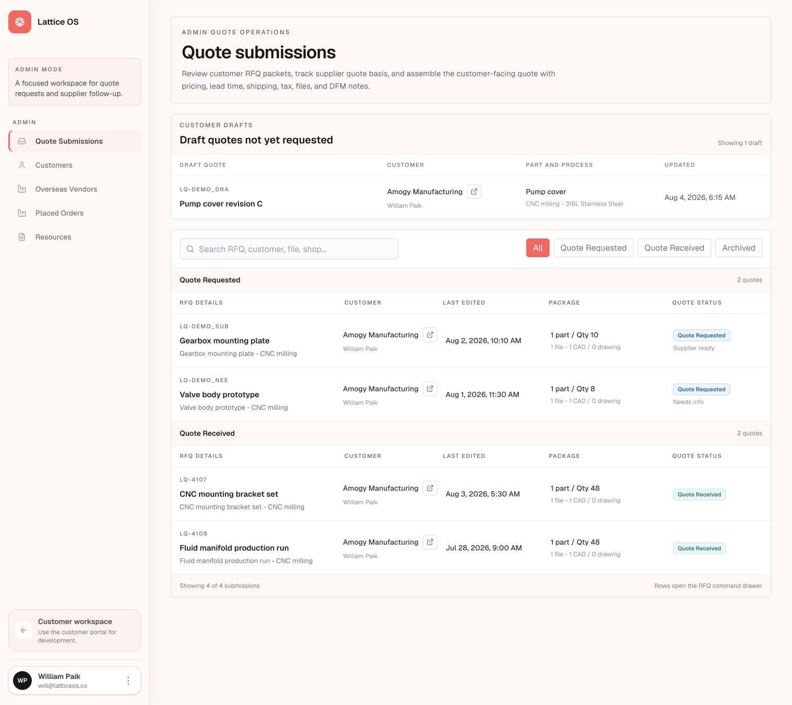
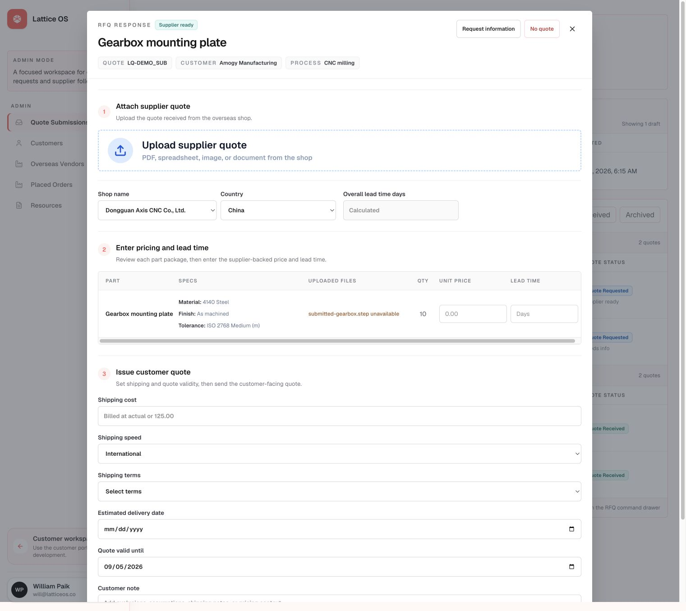
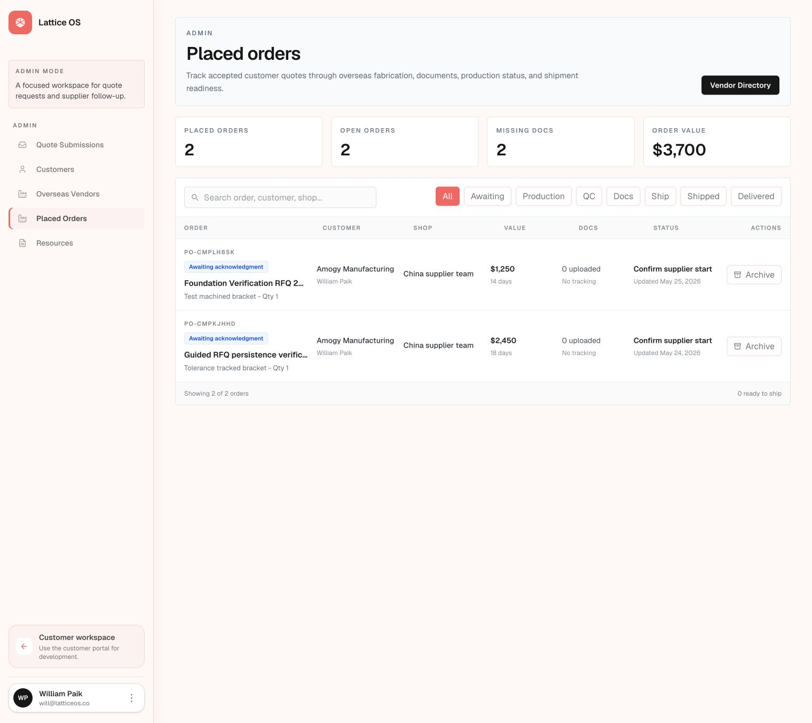
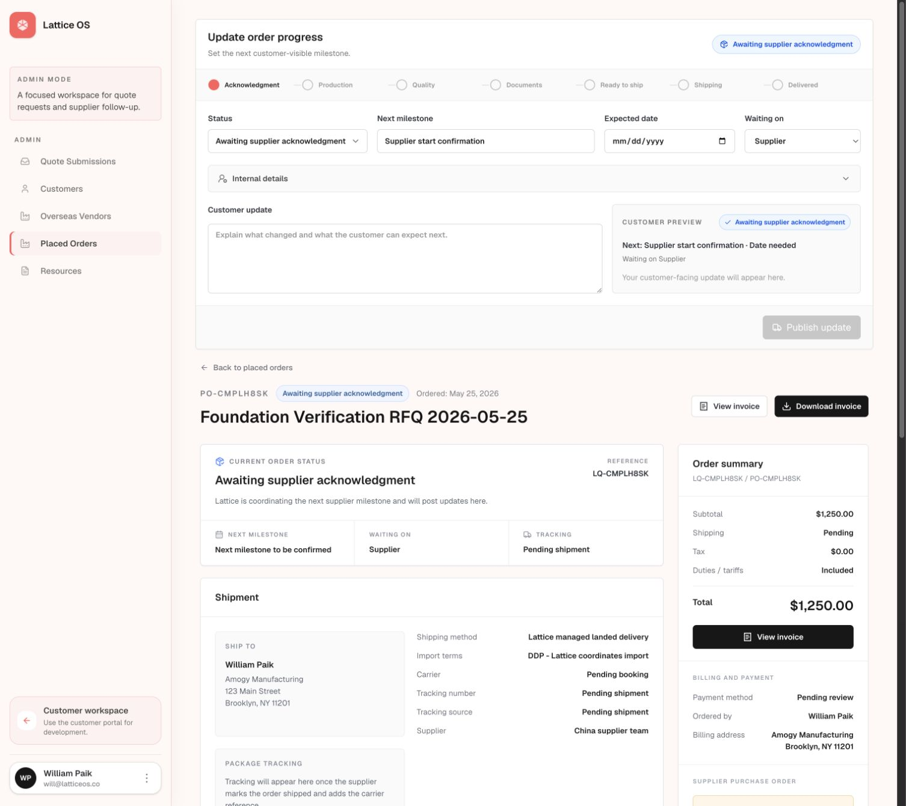
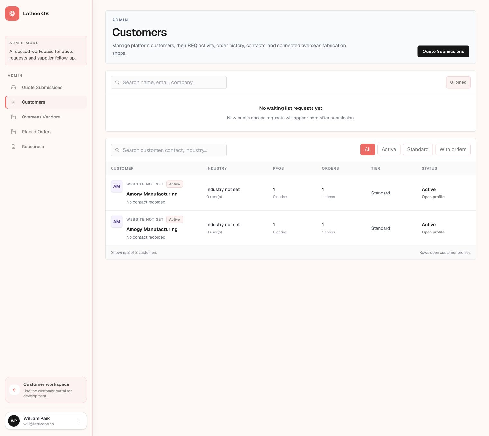
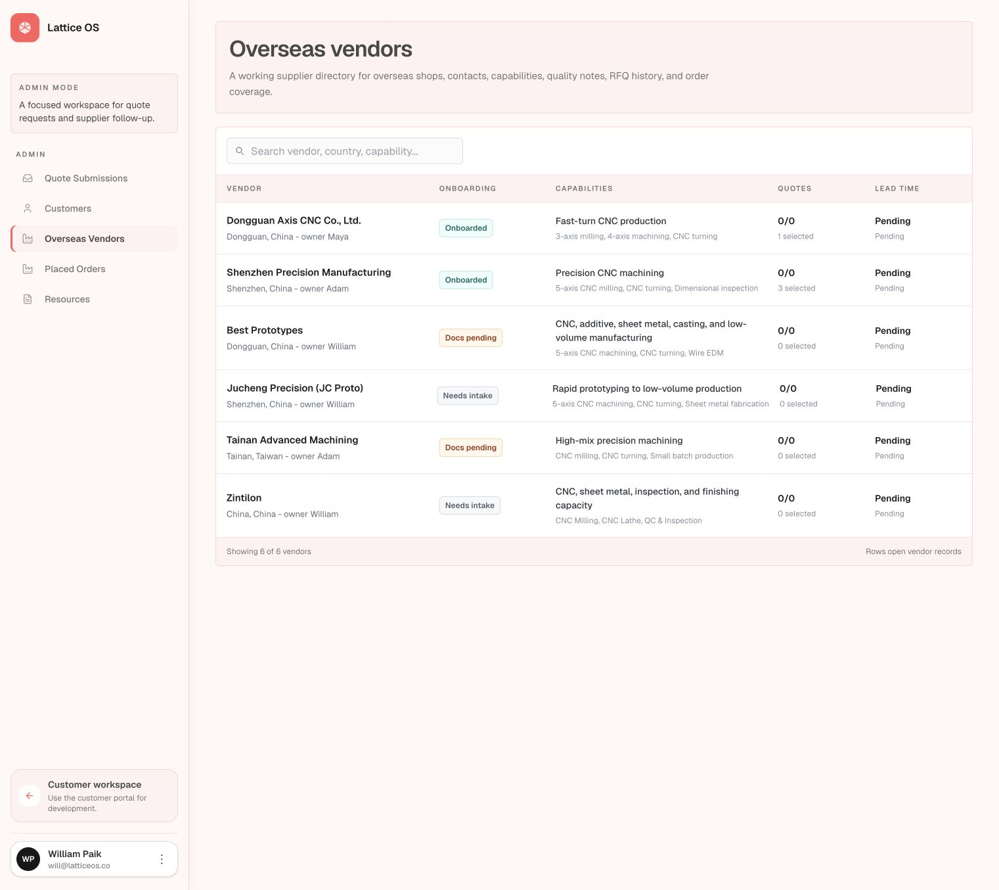
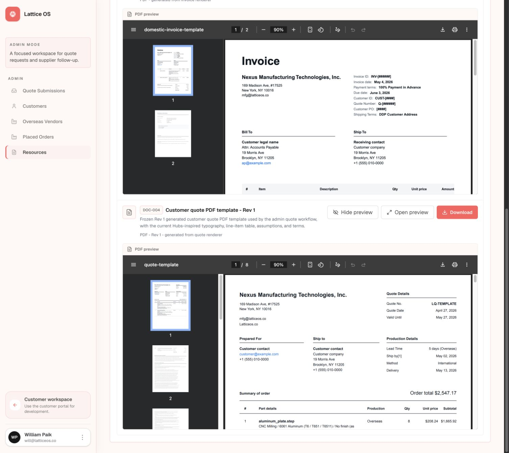
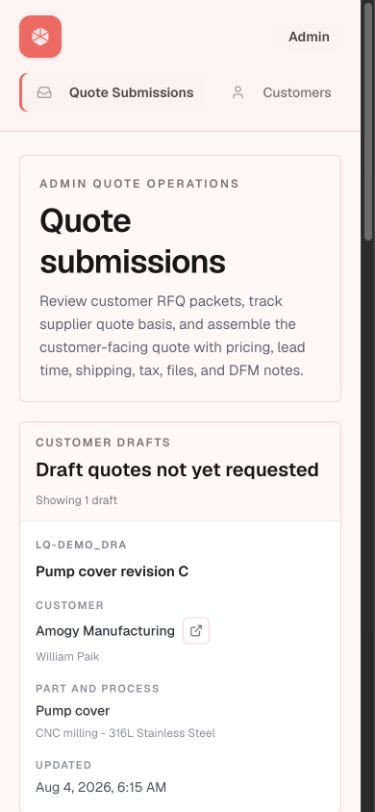

# Lattice OS Admin Workspace UX Audit

Date: August 6, 2026

## Executive summary

The admin workspace has a strong structural foundation: navigation is predictable, tables are readable, the visual language is consistent, and the quote and order workflows expose the right broad concepts. It is not yet ready for a scaled customer rollout because the interface behaves more like a record browser than an operations console. The biggest gaps are prioritization, ownership, workflow readiness, and trustworthy account data.

The design should make four questions answerable within seconds on every operational screen:

1. What requires attention now?
2. Who owns it?
3. How long has it been waiting, and what is due next?
4. What action completes the current step?

## Highest-impact recommendations

### 1. Organize the workspace around exceptions and next actions

Add a consistent operational layer to quotes and orders: owner, age or SLA, next action, due date, and blocker. Default each queue to items requiring attention, with routine records available through filters. Replace passive summary cards with actionable filters such as `3 overdue`, `2 missing documents`, and `4 awaiting supplier response`.

**Why it matters:** Operators should not have to open records or interpret status labels to discover what is late or blocked.

### 2. Simplify the quote command drawer into a completion workflow

Keep the three-step structure, but add a sticky footer with readiness status and the primary issue action. Collapse completed steps, show only required fields, and explain exactly what blocks issuance. Clarify supplier quote basis, shipping semantics, and computed customer totals. Missing source files should visibly block or warn before a quote can be issued.

**Why it matters:** The current drawer is long, the primary action falls below the fold, and an operator can lose confidence about whether the quote is complete.

### 3. Separate order-progress editing from the customer-facing order view

Turn the top of the order page into a focused update surface containing the current state, next milestone, expected date, waiting-on party, customer message, and recent change history. Move the full customer order view behind a `Preview customer view` action or a secondary pane. Make publish impact and notification behavior explicit.

**Why it matters:** The current page combines two information architectures, duplicates status and invoice content, and makes a routine update feel heavier than it should.

### 4. Standardize list and filter behavior across admin modules

Use one admin table pattern with saved views, search, compact status filters with counts, sortable operational columns, and a restrained row action menu. Move destructive actions such as Archive and No quote into overflow menus with confirmation. Keep row click as the primary path to detail.

**Why it matters:** Quotes, orders, customers, and vendors currently vary in filter logic and action placement, increasing cognitive load and error risk.

### 5. Repair account and supplier data trust before launch

Merge duplicate customer companies, complete the company-user membership model, and replace repeated missing-data placeholders with a single completeness indicator. Make vendors durable records and add operational measures such as onboarding readiness, capabilities, response time, quality, and on-time delivery.

**Why it matters:** Duplicate companies and largely empty supplier metrics undermine operator trust and can cause quotes or orders to be associated with the wrong entity.

## Supporting recommendations

- Reduce the coral tint across backgrounds and borders. Reserve coral for admin identity, primary actions, selection, and alerts; use neutral surfaces for routine content.
- Remove or compress oversized descriptive header panels after the first visit. The page title, one sentence, and the primary action are enough.
- Treat customer drafts as a saved quote view rather than a separate block above the operational queue.
- Replace `Last edited` with operationally useful columns such as `Waiting`, `Next due`, and `Owner`.
- Separate current state from next action. For example, show `Awaiting supplier acknowledgement` as status and `Confirm supplier start` as the action.
- Reduce the eight order filter buttons to lifecycle groups or a status menu with counts.
- Hide document previews by default. Open one template at a time in a side panel or modal and show owner, version, status, and last updated in the compact list.
- On mobile, replace the clipped horizontal admin navigation with an explicit menu or scroll affordance, reduce the oversized header, and surface search and priority filters before record content.

## Screen-by-screen review

### 1. Quote submissions: Good foundation, needs prioritization

The queue is readable and status grouping is clear. Drafts, requested quotes, and received quotes are visually separated, but the screen does not expose owner, age, urgency, SLA, or next action. The large header and separate draft block push the active queue down, while coral borders give routine content unnecessary alert weight.

### 2. Quote command drawer: Needs simplification

The numbered stages are a useful model. The drawer is too tall for a frequent task, the issue action is below the fold, and readiness is not summarized. Pricing and shipping inputs are ambiguous, the pricing region introduces horizontal overflow, and the unavailable STEP file is not clearly connected to whether issuance is allowed.

### 3. Placed orders: Good density, cluttered controls

The table supports scanning well. The KPI row and eight status controls consume substantial space, archive is too prominent, and the status column mixes lifecycle state with the operator's next action. Add owner, expected milestone, and SLA or waiting time.

### 4. Order progress: Needs restructuring

The customer preview is a valuable concept, but the page asks operators to manage an update form and a full customer detail page simultaneously. Consolidate progress editing, history, and publishing into one focused surface and move the customer view to an explicit preview.

### 5. Customers: Not operationally ready

The directory is visually clean, but duplicate company rows are a serious trust problem. The empty waiting-list section dominates the page, filters mix unrelated dimensions, and the records lack account owner, activity, open actions, value, and health. Active companies with zero users also reveal an incomplete membership model.

### 6. Vendors: Clean prototype, insufficient decision support

The table is compact, but most cells are pending or zero and the quote metric is unclear. Add onboarding and data-completeness states, capability and geography filters, performance measures, and a clear owner. Avoid awkward repeated locations such as `China, China`.

### 7. Resources: Needs progressive disclosure

All PDF previews are expanded, producing an extremely long page and slow navigation. Default to a compact template list and load one preview on demand in a dedicated pane. Repeated preview and download controls should be consolidated.

### 8. Mobile admin: Needs a navigation pass

The stacked record treatment is workable, but the top-level admin navigation is clipped with no clear overflow affordance. The title panel takes most of the first viewport, delaying search and operational content. Mobile should prioritize menu access, urgent work, and record scanning.

## Accessibility and safety risks

- Verify that the quote drawer traps focus, returns focus on close, and keeps its primary action reachable at 200% zoom.
- Ensure every status remains understandable without color and meets text and border contrast requirements.
- Give disabled actions a programmatically associated explanation, especially `Publish update`.
- Give embedded PDF frames descriptive titles and do not load all frames by default.
- Preserve table meaning when rows reflow on narrow screens and provide a keyboard-accessible row-detail action.
- Confirm destructive actions with the affected record name and explain downstream impact.
- Avoid horizontal scrolling inside the quote drawer; it creates a high-risk editing problem at zoom and on smaller displays.

## Recommended rollout sequence

1. Fix customer duplication, membership integrity, and vendor persistence.
2. Add owner, age/SLA, blocker, due date, and next action to quote and order queues.
3. Redesign quote completion and order progress publishing around focused, validated workflows.
4. Standardize list filters, row actions, responsive behavior, and accessibility states.
5. Apply the visual cleanup: neutral surfaces, smaller headers, tighter spacing, and progressive document previews.

## Evidence limits

This audit reflects the locally rendered admin workspace and its current demo states on August 6, 2026. It did not include production analytics, interviews with operators, screen-reader testing, keyboard-only testing, or live multi-user and supplier workflows. Those should be completed before general customer rollout.
