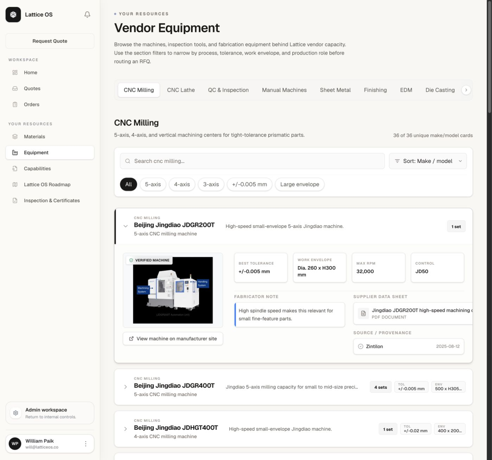
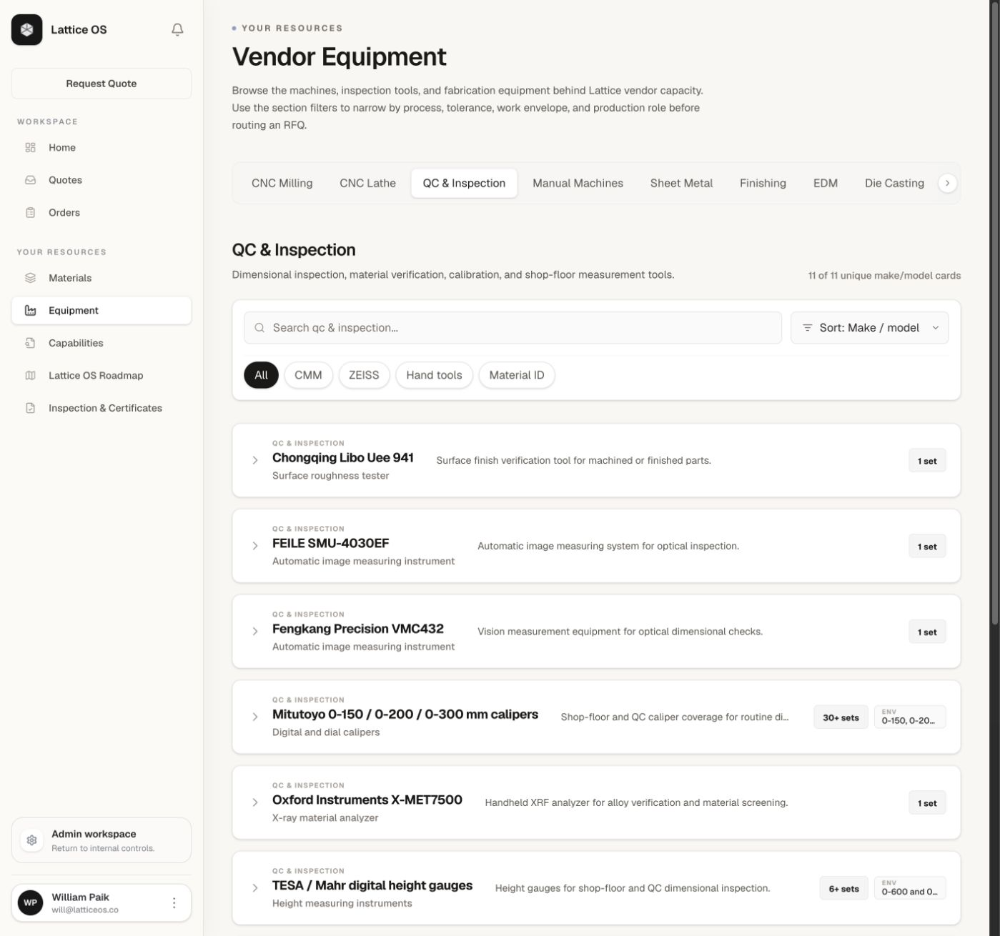
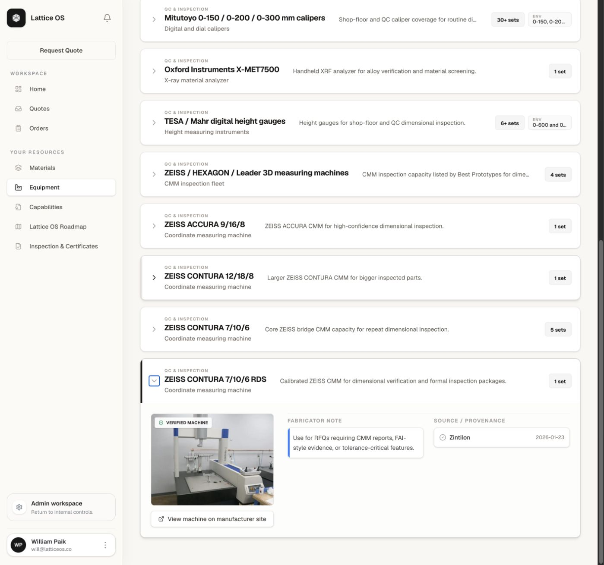
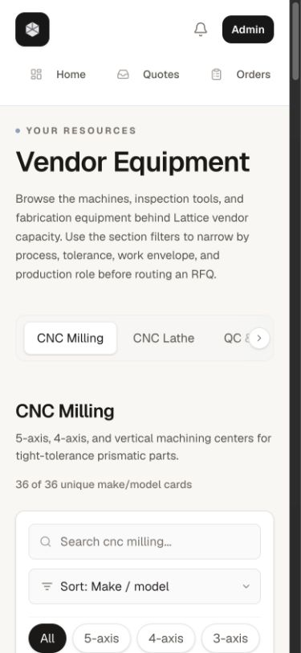

# Equipment Page Audit

Date: 2026-08-08  
Surface: `/equipment`  
Mode: Combined UX, content, and accessibility audit

Figma-ready PNG exports: [`figma-import/`](./figma-import/manifest.md)

## Audit scope

This audit reviews the customer-facing Equipment page as a reference surface for machine-shop buyers. It covers the catalog overview, CNC milling detail presentation, QC and inspection presentation, an expanded CMM record, responsive reflow at 390 × 844, and the underlying equipment dataset used by the page.

The primary customer goal is to answer three questions with confidence:

1. Can the supplier network make my part?
2. Which machine and inspection process are appropriate for it?
3. What evidence supports the stated capacity and precision?

## Overall verdict

The page has an unusually strong proof-oriented foundation: 83 equipment records, real make/model names, quantities, work envelopes, tolerances, controls, supplier dates, manufacturer links, and selected data sheets. It feels materially more credible than a generic capability page.

It is not yet safe to treat as a customer reference document, however. The interface currently presents supplier-reported specifications as verified network capability, labels every image/card as a “Verified Machine,” and describes vendor or third-party pages as manufacturer links. Those claims are stronger than the visible evidence. The page also makes customers browse a long internal-style inventory before helping them decide which capability fits their part.

## Captured steps

### Step 1 — Catalog overview: needs refinement

**Strengths**

- The process navigation, search, filters, and sort controls make a large catalog manageable.
- The first open record immediately demonstrates the intended proof model: machine photo, tolerance, envelope, RPM, control, fabricator note, data sheet, and provenance.
- Real model names and fleet quantities are high-value trust signals for experienced buyers.

**Risks**

- “Vendor Equipment” and “36 of 36 unique make/model cards” sound like internal repository language. A customer needs to know whether this is owned equipment, supplier-network equipment, currently routable capacity, or representative capability.
- The first useful customer decision is not “which make/model alphabetically?” It is usually process fit, part size, axis requirement, tolerance class, material, lot size, and inspection evidence.
- A 36-row milling list is dense. The default alphabetical order does not surface the strongest or most relevant capacity first.
- “Best Tolerance” appears as a precise promise without explaining whether it is machine positioning accuracy, supplier-reported machining capability, demonstrated process capability, or a part-level tolerance Lattice will quote.
- The persistent `Request Quote` action is visually distant from the equipment evidence. There is no contextual action such as “Review this capability for my part.”

### Step 2 — QC and inspection inventory: needs refinement

**Strengths**

- Inspection equipment is treated as first-class capacity rather than an afterthought.
- CMM, ZEISS, hand-tool, and material-identification filters map to recognizable inspection needs.
- The inventory includes CMMs, optical measurement, roughness testing, XRF material identification, gauges, and shop-floor tools.

**Risks**

- The section combines calibrated metrology systems, material-identification tools, surface-finish instruments, and ordinary hand tools in one flat list. Those support very different evidence packages.
- Customers cannot see the inspection output they can buy: dimensional report, CMM report, FAI, material verification, surface-roughness report, or calibration certificate.
- Calibration status is present in some source data but is not surfaced consistently at the section or collapsed-card level.
- “Sort: Best tolerance” and “Sort: Max RPM” remain available here even though they are irrelevant or unavailable for most inspection tools.

### Step 3 — Expanded ZEISS CMM record: high-risk claim presentation

**Strengths**

- The machine photo and recent source date provide useful provenance.
- The fabricator note connects the CMM to CMM reports, FAI-style evidence, and tolerance-critical features.
- The expanded state remains visually calm and easy to scan.

**Risks**

- “Verified Machine” is hard-coded onto every expanded record. The page does not define what was verified, by whom, when, or whether the image is the actual supplier asset.
- The ZEISS link shown as “View machine on manufacturer site” points to a third-party used-machine page, not ZEISS. In the component, the visible link uses `imageSourceUrl`; the separate `machineUrl` field is not used.
- This record omits measurement volume, maximum permissible error/uncertainty, probe configuration, software, environment, accreditation, and calibration-expiry evidence—the details a precision-focused buyer would expect.
- The source card shows only supplier and date. It does not expose the document title, source row, review status, last verified date, or whether the claim is supplier-reported versus independently checked.

### Step 4 — Mobile overview: generally healthy, with density concerns

**Strengths**

- Headings, descriptive copy, search, sort, and filters reflow into a readable single column.
- The section rail makes the broad catalog available without forcing a tall vertical process menu.
- Text remains legible at the tested viewport.

**Risks**

- The fixed header consumes substantial vertical space before the catalog begins.
- The horizontally clipped section rail gives weak visibility into all available processes; the right-arrow control is small and easy to miss.
- The first record opens by default, so mobile users encounter a long detail block before they can compare the rest of the fleet.
- Long data-sheet names and dense detail modules require additional truncation and overflow testing at 200% zoom.

## Data quality findings

The current repository contains 83 records:

| Section | Records |
| --- | ---: |
| CNC Milling | 36 |
| CNC Lathe | 8 |
| QC & Inspection | 11 |
| Manual Machines | 4 |
| Sheet Metal | 12 |
| Finishing | 8 |
| EDM | 1 |
| Die Casting | 1 |
| Additive Manufacturing | 2 |

Source concentration is material: 73 records come from Zintilon and 10 from Best Prototypes. The UI presents this as broad “vendor capacity,” but the dataset is currently dominated by one supplier.

Completeness is uneven:

| Field | Records missing it | Share missing |
| --- | ---: | ---: |
| Supplier/manufacturer data sheet | 75 | 90% |
| Tolerance or accuracy | 30 | 36% |
| Work envelope/range | 36 | 43% |
| RPM | 40 | 48% |
| Control | 44 | 53% |

Only 38 records have a reasonably specific machine/manufacturer URL under the current heuristic. Sixty-five records use a different image-source URL and machine URL, yet the rendered button always uses the image-source URL with the label “manufacturer site.”

The schema also mixes several kinds of records:

- Exact make/model assets such as a Hermle C400.
- Aggregated fleets such as “FANUC Robodrill / Chenggong / Siemens / Mitsubishi VMCs.”
- Process-level summaries such as die casting or additive manufacturing equipment.
- Planned/arrival-noted equipment.
- Metrology assets and ordinary hand tools.

These should not all receive the same verification label or card structure.

## Accessibility risks

- Each equipment row is a `role="button"` container that contains a real `<button>`. This creates two controls for the same action, produces duplicate accessible targets, and makes the parent control's accessible name extremely long.
- Section buttons explicitly remove their focus outline and ring. The sort control also removes its outline without a clear replacement. Keyboard users may not be able to see where focus is.
- Several small uppercase labels use very light gray text. Contrast should be measured against WCAG AA rather than assumed from the screenshot.
- The 24–28 px chevron and horizontal-scroll controls are below a comfortable touch-target size.
- Positive foundations include real heading hierarchy, labeled search/sort fields, `aria-pressed` on section choices, `aria-expanded` on disclosure buttons, descriptive image alt text, and a logical DOM reading order.

## Highest-impact recommendations

1. **Define a claim model before visual polish.** Replace the universal “Verified Machine” badge with explicit statuses such as `Supplier reported`, `Document reviewed`, `Lattice verified on [date]`, and `Representative image`. State what each status means.
2. **Separate specification from guarantee.** Rename `Best Tolerance` to `Supplier-reported machining tolerance` or `Listed machine accuracy` as appropriate. Add a standing note that quoted part tolerance depends on geometry, material, setup, process capability, and the agreed inspection plan.
3. **Make the page part-first.** Add a short capability summary above the inventory and filters for process, axis count, maximum part size, tolerance band, material family, production quantity, and available inspection evidence. Let make/model remain the proof layer underneath.
4. **Create an inspection-evidence layer.** Group QC assets by output: dimensional/CMM, material verification, surface finish, optical inspection, and shop-floor measurement. Connect each group to the deliverables a customer can request.
5. **Repair provenance and links.** Render the actual `machineUrl` for manufacturer links; label third-party image sources accurately; expose source-document title, document date, review date, evidence type, and source row internally or in a customer-safe provenance drawer.
6. **Normalize the dataset.** Split exact assets, aggregated fleets, process summaries, and planned equipment into distinct record types. Make unsupported sort options section-specific. Add explicit unknown values instead of silently omitting critical fields.
7. **Reduce comparison cost.** Default to a compact capability overview or curated “precision,” “large envelope,” and “production capacity” groups. Keep the full equipment registry available for buyers who want the deep reference.
8. **Fix disclosure semantics and focus.** Use one real button per row with `aria-expanded` and `aria-controls`, restore visible focus states, enlarge touch targets, and validate horizontal navigation and cards at 200% zoom.

## Evidence limits and verification gaps

This audit used current screenshots, the live rendered DOM, and the local equipment dataset/component. It did not independently verify supplier ownership, serial numbers, current machine availability, manufacturer specifications, calibration certificates, image authenticity, or the accuracy of vendor-provided source documents. It is not a full WCAG conformance audit; contrast ratios, screen-reader behavior, complete keyboard order, browser zoom, and device testing still require dedicated verification.
