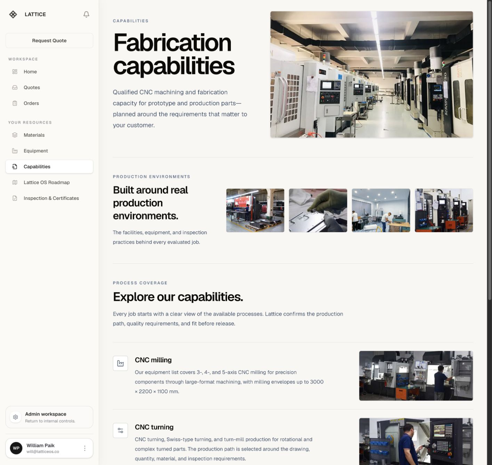
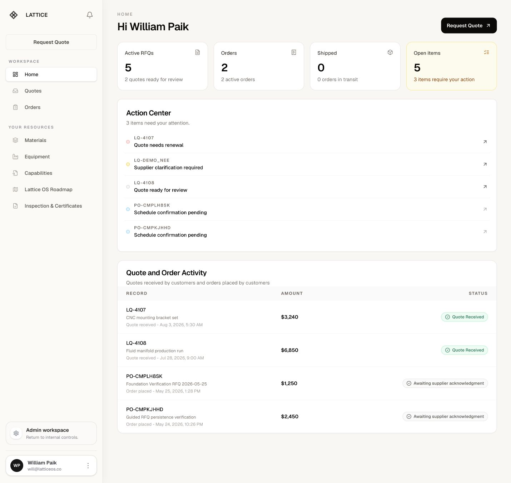
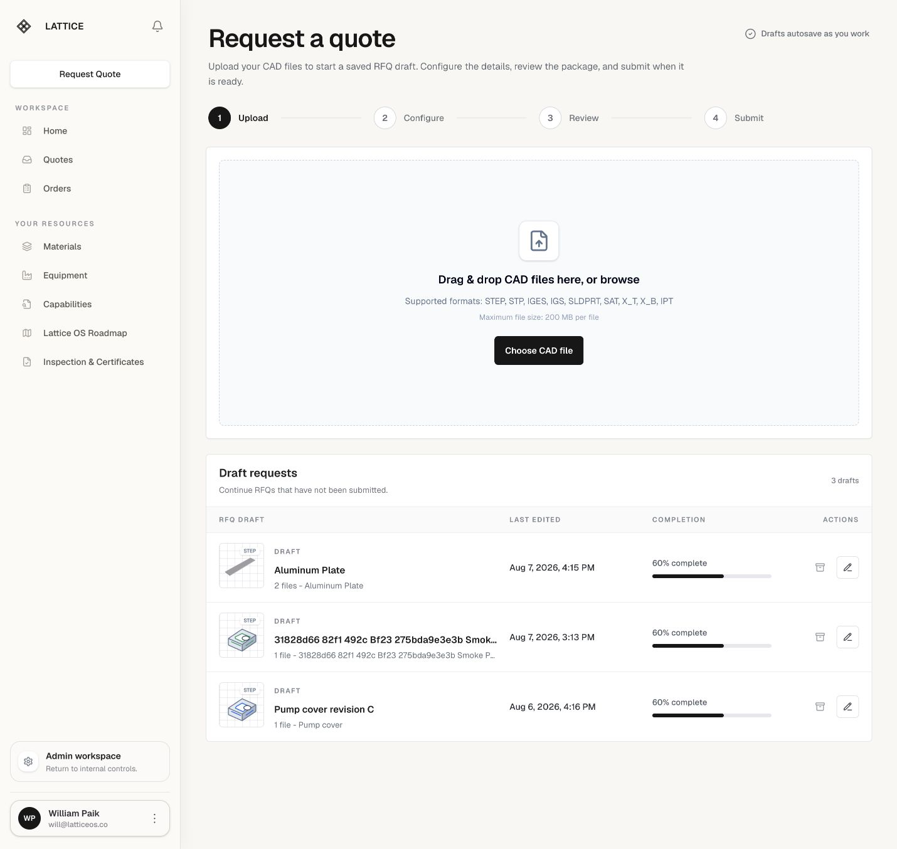
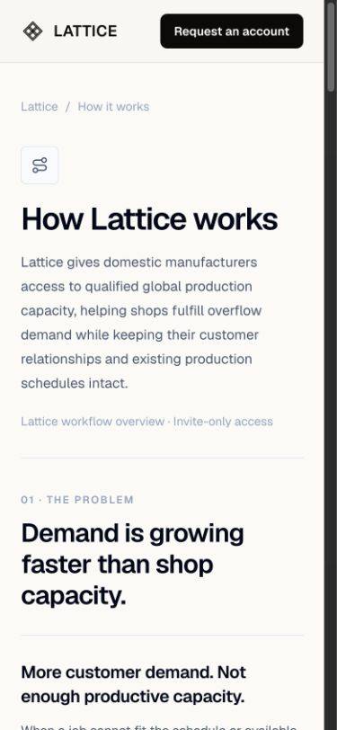
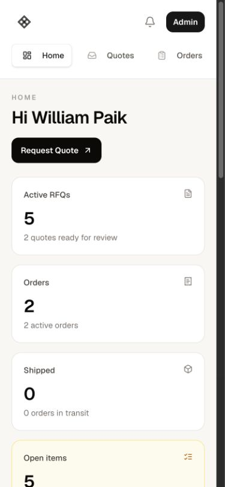

# Lattice application QC report

Date: 2026-08-17

Environment: local development app at `http://localhost:3000`, authenticated admin session

Scope: public marketing pages, customer workspace, representative RFQ/quote flows, resource catalogs, admin route smoke tests, responsive layout, automated checks, and release-readiness review

## Executive verdict

**Status: not ready for an external production release.** The codebase passes typecheck, lint, all 305 automated tests, and a production build. The public pages and most read-only workspace routes are visually healthy on desktop and mobile. However, the core RFQ and quote experiences have reproducible React hydration failures caused by browser-local data being read during the first client render. The repository also still documents unresolved production requirements for durable authorization, file storage, email, payments, and database rollout.

No destructive or business-state-changing actions were performed. Quote submission, quote acceptance, payment, email delivery, file upload persistence, and supplier updates were intentionally not executed in this review.

## Automated checks

| Check | Result | Notes |
| --- | --- | --- |
| `npm run typecheck` | Pass | No TypeScript errors. |
| `npm run lint` | Pass | No lint errors. |
| `npm test` | Pass | 68 test files; 305 tests passed. |
| `npm run build` | Pass | Production build completed and generated 33 static pages. |
| `npm run dead-code` | Fail | Unused file: `src/components/catalog-card.tsx`. |
| Vitest configuration | Warning | Vite reports that `configLoader: "native"` is loading ESM syntax through CJS. |

## Journey QC

### 1. Public discovery — Healthy

Routes checked: `/`, `/how-it-works`, `/waiting-list`, `/simple-quote`.

- Marketing pages loaded with expected content and no horizontal overflow at desktop and 390 × 844 mobile widths.
- Navigation and primary links were present and named.
- No missing image alt text or duplicate element IDs were found in the sampled routes.
- **Defect:** `/simple-quote` produces a hydration mismatch because a part ID is created with `Date.now()` and `Math.random()` during the initial render. The server and client produce different input names. See `src/components/simple-quote-form.tsx:27`.

### 2. Authentication and route authorization — Partially healthy

- The authenticated customer/admin workspace loaded normally.
- `/admin` redirected to `/admin/quotes` as expected.
- An admin opening `/supplier/orders` was redirected to `/admin/quotes`, confirming the sampled role guard.
- Anonymous access to a quote PDF returned the expected `401` JSON response.
- **Release blocker:** the current customer ownership model is exact requester-email matching rather than durable company membership.
- **Release blocker:** supplier order, invoice, document, and update access still need awarded-shop ownership checks.
- **Release blocker:** durable users, organization membership, password recovery, MFA/passkeys, session/device controls, and identity audit events remain documented future hardening.

### 3. Create and resume an RFQ — Degraded

Routes checked: `/requests/new` and `/requests/new?draft=local_draft_msja586q_56oyp5`.

- The upload/configure/review/submit workflow rendered, including draft continuation, material, finish, tolerance, drawing, inspection, and review controls.
- A configured local draft could be reopened without submitting it.
- **P1 defect:** `/requests/new` hydrates with a different draft list than the server rendered because localStorage is read during the state initializer. In the observed run the server rendered one draft while the client immediately rendered three. React discarded and regenerated the tree. See `src/components/request-form.tsx:1318` and the local initializers in `RequestForm`.
- **P1 defect:** opening a local draft hydrates with a different current step and completion state than the server. This changes `aria-current` and step icons during hydration. See the local-draft initialization around `src/components/request-form.tsx:2912`.
- **Impact:** unreliable event attachment, visible layout/state changes, lost SSR benefits, noisy error monitoring, and elevated regression risk in the primary conversion flow.

### 4. Quote queue and quote detail — Degraded

Routes checked: `/quotes` and `/quotes/demo_quoted_brackets`.

- Quote lists, pagination, quote detail, pricing, address, activity, PDF link, and the accept-quote control rendered.
- **P1 defect:** `/quotes` reads local RFQ drafts and deleted IDs in `useState` initializers. Client-local rows are inserted before hydration, so the client and server render different quote rows and React regenerates the tree. See `src/components/buyer-quotes.tsx:324`.
- Authenticated quote PDF generation, quote acceptance, checkout, PO upload, and payment were not executed.

### 5. Orders and quality documentation — Healthy for read-only use

Routes checked: `/orders`, `/quality-documentation`, and `/notifications`.

- The lists and documentation pages loaded with expected headings and controls.
- No desktop overflow, unnamed visible buttons/links, missing alt text, or duplicate IDs were found in the sampled states.
- Live order lifecycle updates, invoice issuance, shipment tracking, and quality-document upload/review were not executed.
- **Production gap:** durable issued-invoice snapshots remain future accounting hardening.

### 6. Workspace resources — Mostly healthy

Routes checked: `/materials`, `/materials/inquiry`, `/equipment`, `/capabilities`, and `/roadmap`.

- Materials loaded all 12 family cards.
- Equipment loaded 62 milling models; applying the 5-axis filter correctly changed the result count to 23, and an equipment disclosure opened with technical details.
- The Capabilities production gallery correctly replaced the hero image when a thumbnail was selected and restored the intended default after a fresh page load.
- The Capabilities page, dashboard, and public pages were visually stable at sampled desktop/mobile widths.
- **P2 accessibility defect:** the Capabilities heading is visually split across lines and would otherwise compute as `Fabricationcapabilities`; the page currently protects this with an explicit `aria-label`, so keep this regression test in place.
- **P3 cleanup:** `src/components/catalog-card.tsx` is unused and fails the dead-code check.

### 7. Account settings — Needs accessibility and hydration hardening

Route checked: `/account/settings`.

- Settings content loaded, but the page has no `<h1>`, weakening page structure and screen-reader orientation.
- **P2 accessibility defect:** the hidden profile-photo file input has no associated label or `aria-label`. See `src/components/profile-picture-editor.tsx:350`.
- **P2 risk:** account settings use a localStorage-aware function inside a `useState` initializer. This repeats the same server/client divergence pattern as the reproduced RFQ and quote defects, even though it did not fail on the final fresh navigation. See `src/components/account-settings-workspace.tsx:270`.

### 8. Admin workspace — Healthy for route access; production data path incomplete

Routes checked: `/admin/quotes`, `/admin/orders`, `/admin/customers`, `/admin/vendors`, `/admin/resources`, and `/admin/material-inquiries`.

- Every sampled admin route rendered the expected page. One material-inquiries navigation timed out once while the correct page was already visible; a repeatable functional failure was not established.
- **P1 production-readiness issue:** the console repeatedly reported `Prisma is unavailable; using local material inquiry data.` The fallback keeps development usable, but production must fail observably rather than silently serving local fallback data when the database is expected.
- **Release blocker:** the repository documents unapplied production Prisma changes, including Stripe checkout fields.

## Prioritized fix list

### P1 — fix before external release

1. **Make first renders deterministic on `/simple-quote`, `/requests/new`, and `/quotes`.**
   - Generate stable initial IDs on the server or after mount; do not call `Date.now()` or `Math.random()` in SSR-visible initial state.
   - Render server-safe defaults first, then load localStorage in `useEffect` after hydration.
   - Add SSR/hydration regression tests that render server HTML and hydrate with populated localStorage.
   - Acceptance: no hydration overlay or hydration console error with zero, one, or multiple browser drafts.
2. **Complete production data/integration setup.**
   - Apply pending Prisma migrations/schema changes and verify the app does not fall back to local data in production.
   - Replace `.data/uploads` with R2/S3-compatible storage and verify ownership on uploaded CAD, drawings, supplier files, and customer POs.
   - Configure and verify Resend/domain delivery.
   - Configure Stripe keys/webhook/base URL and test card and PO checkout end to end.
3. **Finish authorization hardening.**
   - Replace exact-email customer ownership with durable company membership.
   - Add awarded-shop ownership checks to every supplier order, invoice, document, and update path.
   - Move role assignment out of email allowlists into durable workspace records.

### P2 — fix before broad customer rollout

4. Add a single descriptive `<h1>` to Account Settings.
5. Give the profile-photo file input an accessible name and preserve keyboard operation of the upload menu/editor.
6. Refactor Account Settings to load browser-local overrides after hydration.
7. Decide and test the intended public/auth policy for `/simple-quote`, `/capabilities`, `/materials`, and `/quality-documentation`; document it in route tests.
8. Add authenticated end-to-end coverage for RFQ submission, quote issuance, quote PDF, quote acceptance, checkout, order creation, quality-document review, and supplier update permissions.

### P3 — maintenance

9. Remove or reconnect unused `src/components/catalog-card.tsx` so `npm run dead-code` passes.
10. Convert the Vitest configuration to a supported ESM form (for example `.mjs` or a package-level module configuration) to remove the Vite loader warning.
11. Replace deprecated `getCdnRedirectUrl` usage before its removal.
12. Upgrade Next.js after reviewing the bundled version-specific migration notes; the local dev overlay reports 16.2.6 while 16.3.1 is available.

## Evidence

### Capabilities desktop

The production gallery and process rows are visually consistent, and thumbnail-to-hero selection works.

### Customer dashboard desktop

The authenticated workspace shell, operational summary, action center, and activity table render cleanly.

### RFQ route with hydration issue observed

The screenshot shows the rendered RFQ page; the hydration defect was observed through the Next.js issue overlay and console diff during this same run.

### How It Works mobile

No horizontal overflow was found at 390 × 844.

### Dashboard mobile

The desktop sidebar collapses into the mobile navigation without horizontal overflow.

## Evidence limits

- Screenshot review cannot establish WCAG compliance. Keyboard order, focus visibility, screen-reader announcements, zoom/reflow, reduced-motion behavior, and color contrast still need dedicated testing.
- Business-state mutations were not authorized by a QC-only request, so no RFQ was submitted, quote accepted, payment made, order updated, email sent, or production file persisted.
- The live supplier workflow could not be exercised with the current admin session; only the role redirect was verified.
- Anonymous route behavior was not exhaustively tested because the existing signed-in browser session was preserved. The quote PDF 401 response was checked separately.
- Stripe, Resend, Prisma production connectivity, object storage, Google SSO, and authenticated PDF generation require configured external services and a staging test account.
